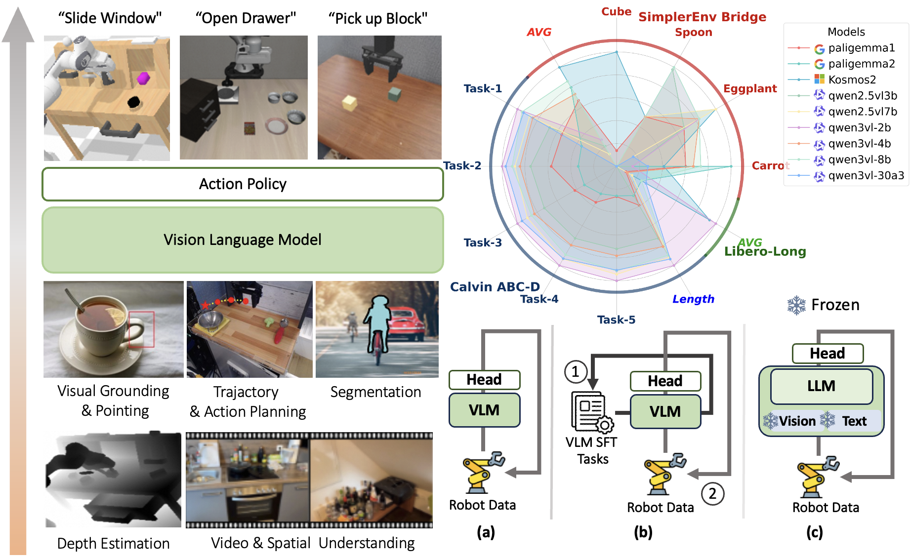
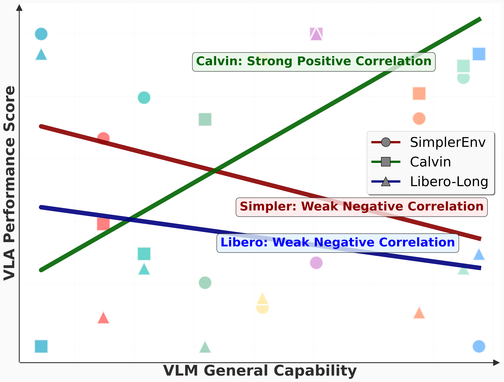
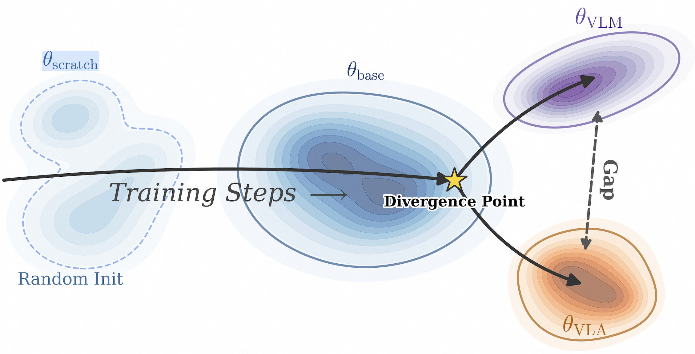

<div align="center">
<h2><center>VLM4VLA: Revisiting Vison-Language-Models in Vision-Language-Action Models</h2>
</div>
<p align="center">
</sup>Jianke Zhang<sup>1</sup>, </sup>Xiaoyu Chen<sup>1</sup>, </sup>Qiuyue Wang<sup>2</sup>, </sup>Mingsheng Li<sup>2</sup>, </sup>Yanjiang Guo<sup>1</sup>, </sup>Yucheng Hu<sup>1</sup>, </sup>Jiajun Zhang<sup>2</sup>, </sup>Shuai Bai<sup>2</sup>, Junyang Lin<sup>2</sup>, Jianyu Chen<sup>1</sup>
</p>
<p align="center">
<sup>1</sup> THU &nbsp;&nbsp;
<sup>2</sup> Qwen Team, Alibaba Inc. &nbsp;&nbsp;
</p>
<p align="center">
<a href='https://arxiv.org/abs/2601.03309'></a> <a href='https://cladernyjorn.github.io/VLM4VLA.github.io/'></a> 
</p>
We present a simple and effective framework to fairly benchmark different Vision-Language Models (VLMs) as backbones for robotic policies, revealing a notable performance gap that highlights a disconnect between the VLM and VLA domains.

<p>
    
</p>


We find that the performance of VLMs on general benchmarks does not reliably predict their effectiveness in VLA tasks. Specifically, among the three environments we evaluated, only CALVIN shows a positive correlation between VLM general capabilities and VLA performance, while in the other environments the two exhibit little to no clear correlation.

<p>
  
</p>

In our experiments, we found that the visual module within the VLM is a major bottleneck when transferring VLMs to VLA tasks. By applying Fast-Token fine-tuning on the Bridge dataset, we suspect that the representations learned by current VLMs differ significantly from the representations required for action control.


##  Content

- [Installation](#installation)
- [Adding VLM Baselines](#adding-vlm-baselines)
- [Training](#training)
- [Evaluation](#evaluation)


## Installation 

In our experiments, the training environment is independent from each testing environment. For testing, we recommend first installing the training environment (including the libraries required for inference), and then installing the additional libraries needed for each testing environment separately.

1. For training VLM4VLA：


```bash
# installation for traing
pip install -e .

# # # # # for calvin training
cd calvin
sh install.sh
cd ..
# this is just for install dataloading and preprocess tools, you can ignore the error about rendering or evaluation

# # # # # for simpler and libero training
pip install hydra-core --upgrade 
pip install bitsandbytes pretty_errors
cd openvla
pip install -e .
cd dlimp_openvla
pip install -e . 

```

2. For evaluation on different benchmarks:

```bash
# # # # # For CALVIN Evaluation
git clone --recurse-submodules https://github.com/mees/calvin.git
cd calvin
# create conda env first if you want, then:
sh install.sh # remember to check torch version
# prepare dataset 
cd dataset
sh download_data.sh debug
sh download_data.sh D
sh download_data.sh ABC
sh download_data.sh ABCD
# validate enviroment
cd ..
python eval/calvin/env_test.py

# # # # # For SimplerEnv Evaluation
git clone https://github.com/simpler-env/SimplerEnv --recurse-submodules
cd SimplerEnv/ManiSkill2_real2sim
# create conda env first if you want, then:
pip install -e .
cd ..
pip install -e .
pip install mediapy decord numpy==1.24.4
# validate enviroment
cd ..
python eval/simpler/env_test.py

# # # # # For Libero Evaluation
# create conda env first if you want, then:
git clone https://github.com/Lifelong-Robot-Learning/LIBERO.git
cd LIBERO
pip install -r requirements.txt
pip install -e .
# prepare dataset (check the official repo for more choice)
python benchmark_scripts/download_libero_datasets.py
# validate enviroment
cd ..
python eval/libero/env_test.py


```

To ensure compatibility between the libraries required for inference and those needed for testing, we recommend first installing the libraries required for the inference VLM as described in Step 1, and then installing the libraries needed for each test environment separately. To maintain compatibility, we suggest using Python 3.8–3.10 in the CALVIN and LIBERO environment (versions higher than 3.8 on CALVIN may require minor modifications to certain libraries), and Python 3.10 for the Simpler. Overall, we suggest using Python 3.10 for both training and evaluation.


## Adding VLM Baselines

VLM4VLA is built on top of the [RoboVLMs](https://github.com/Robot-VLAs/RoboVLMs) framework. We modified the originally supported VLMs and updated several model configurations as well as the action chunk trick. Instructions for adding or modifying model parameters can be found in the tutorials provided in the [RoboVLMs](https://github.com/Robot-VLAs/RoboVLMs) repository. As a reference, our core model configurations and codes are located in the `configs` and `vlm4vla/model/backbone`, respectively. 

Below, using Qwen2.5-VL as an example, we describe in detail how to integrate a new model and apply the architectural modifications.

In `vlm4vla/model/backbone/roboqwen25vl.py`, we implement the core function of integrating Qwen2.5-VL into VLM4VLA.

- `def image_processor(self)`: we modify this function to resize all images into 224x224, which will be used in the dataloader part to preprocess images. By adding this, we can avoid the influence of different input image sizes and simplify the dynamic image resolution used in Qwen2.5-VL.
- `def forward_continuous()`: we rewrite this function in `base_backbone` to support more recent VLM architectures. We take use of image sequences, text processed in dataloader using `qwen_vl_utils` and rearrange their embeddings in this function, as shown in Appendix 2.3. We then feed the concatenated sequences into VLM backbone via `Qwen2_5_VLForConditionalGeneration.forward()`. (For Qwen3VL, besides input embeddings, you should also take care of deep stack features.)

In `vlm4vla/model/policy_head` provides the FCDecoder head we used for all models by default. Besides, as a reference, we also implement a pi0-style (layer-wise attention) flow-matching head for Qwen3VL, referring [StarVLA](https://github.com/starVLA/starVLA) in `vlm4vla/model/policy_head/fm_decoder.py`. (Since our experiments did not cover the flow-matching head, the performance on FMDecoder is not carefully checked.)

In `configs/calvin_finetune/finetune_qwen25vl-3b_calvin.json`, we define all configurations of the model on CALVIN benchmark. We keep the below core settings shared across all VLM4VLA baselines for fair comparison:

```
"image_size": 224, # Input image size
"window_size": 1, # Sliding window size (history length), 1 for not using history
"fwd_pred_next_n": 10, # Number of target action chunks to predict on CALVIN
"batch_size": 16, # Batch size on single GPU (use together with trainer.accumulate_grad_batches to keep all models have the same global batchsize -128 for CALVIN)
"act_head": {
        "type": "FCDecoder",
        "hidden_size": 1024,
        "action_dim": 7,
        "latent": 1, # leanable action query, using 1 as shown in paper
        "action_space": "continuous",
    },
"train_setup": { # fully finetune all VLM parameters without using LoRA
    "precision": "bf16",
    "train_vision": true,
    "freeze_backbone": false,
    "tune_mm_mlp_adapter": false,
    "train_text_embedding": true
},
```
For QwenVL, you may use transformers >= 4.57.0. For Qwen3VL series, please use `RoboQwen3VL` instead of `RoboQwen3VL_int` for key `robovlm_name` in json file (the latter is used for the internal version of transformers, which we reported in the paper).


## Training

To start the training process, use `scripts/run.sh` followed by related configs, we provide all baseline configs under `configs`, categorized by benchmarks. For all models except  Qwen3VL-30B-A3B, training can be done using 8xA100. For training Qwen3VL-30B-A3B, we provide FSDP and Deepspeed in `configs/multinode_example`. For 30A3 results, we take use of Deepspeed and train 50k step using 8x H200(140G memory).

```
bash scripts/run.sh configs/calvin_finetune/finetune_qwen25vl-3b_calvin.json
bash scripts/run.sh configs/oxe_training/bridge/finetune_qwen25vl-3b_bridge.json
bash scripts/run.sh configs/oxe_training/libero10/finetune_qwen25vl-3b_libero10.json
```

During training, the training configurations and checkpoints are automatically saved to the `output_root`and `log_root` specified in the config. To enable direct loading of the trained model during testing, the checkpoints must be converted and the training configuration files collected beforehand. The configuration files will then be automatically loaded during testing.

```bash
python transform_ckpt.py --ckpt_dir $path
# path is the directory to the checkpoints saved during training
# this will generate a new checkpoint in `output_root/torch_checkpoints_fp32`
```


## Evaluation

Add the paths to your checkpoint  (should be converted to FP32 using `transform_ckpt.py`) to `eval/calvin/eval_ckpts.py`, `eval/libero/eval_ckpts_libero.py`, `eval/simpler/eval_ckpts_bridge-30a3.py`. The scrips will automatically evaluate all checkpoints (saved at different training steps) under the `base_paths`. Then, run the following scripts to evaluate:

```bash
# For Calvin
python eval/calvin/eval_ckpts.py

# For Bridge
sudo ln -s path_to_simpler_env/SimplerEnv/ManiSkill2_real2sim/data/real_inpainting real_inpainting
python eval/simpler/eval_ckpts_bridge.py
# for Libero
python eval/libero/eval_ckpts_libero.py
```

The test scripts above will create a results folder for each training-step checkpoint under the `base_path`, containing the task success rates for different action‑chunk lengths. For CALVIN, multi‑GPU testing is supported (by adjusting the number of GPUs). For Simpler and LIBERO, only single‑GPU testing is supported.

#### **Checkpoints**

To facilitate reproducibility, we plan to release all checkpoints for each version of VLM4VLA. Since the paper evaluates multiple VLMs as backbones, we are still working on organizing the corresponding resources.


## Acknowledgement

VLM4VLA is conducted based on [RoboVLMs](https://github.com/Robot-VLAs/RoboVLMs), a scalable VLA framework. We appreciate their excellent work!


## Bibtex 
If you find our work helpful, please leave us a star and cite our paper. Thank you!
```
@article{zhang2026vlm4vla,
  title={VLM4VLA: Revisiting Vision-Language-Models in Vision-Language-Action Models},
  author={Zhang, Jianke and Chen, Xiaoyu and Wang, Qiuyue and Li, Mingsheng and Guo, Yanjiang and Hu, Yucheng and Zhang, Jiajun and Bai, Shuai and Lin, Junyang and Chen, Jianyu},
  journal={arXiv preprint arXiv:2601.03309},
  year={2026}
}
```
